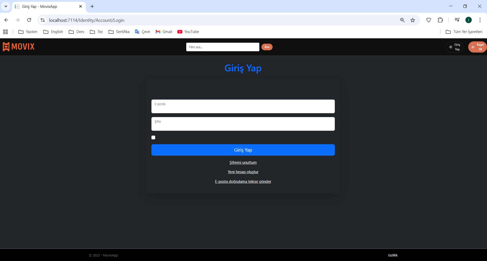

# 🎬 MovixApp

ASP.NET Core MVC ile TMDB API’den film verilerini alan bir film keşif uygulaması.  
Kullanıcılar popüler filmleri görüntüleyebilir, türlere göre filtreleme yapabilir, arama ile film bulabilir ve detay sayfalarına ulaşabilir.  
Ayrıca giriş/kayıt sistemi ve favoriler özelliği de mevcuttur.

---

## 🚀 Özellikler
- Popüler filmleri listeleme
- Türlere göre filtreleme (sidebar)
- Arama
- Film detay sayfası
- Favorilere ekleme
- Kayıt / Giriş sistemi
- Bootstrap 5 + custom CSS ile modern tasarım

---

## 🖼️ Ekran Görüntüleri

### Anasayfa


### Kayıt Ol


### Giriş Yap


### Favoriler


### Detay Sayfası


> Not: `draw.png` geliştirici notları / diyagram için kullanılmıştır.  
İstersen README’de ayrı bir **Diyagramlar** bölümünde gösterebilirsin.

---

## 🛠️ Teknolojiler
- ASP.NET Core MVC
- Bootstrap 5
- Entity Framework Core
- Identity (kullanıcı girişi/kayıt)
- IMemoryCache
- TMDB API

---

## 📦 Kurulum

```bash
git clone https://github.com/iremkabaoglu/MovixApp.git
cd MovixApp
dotnet run
